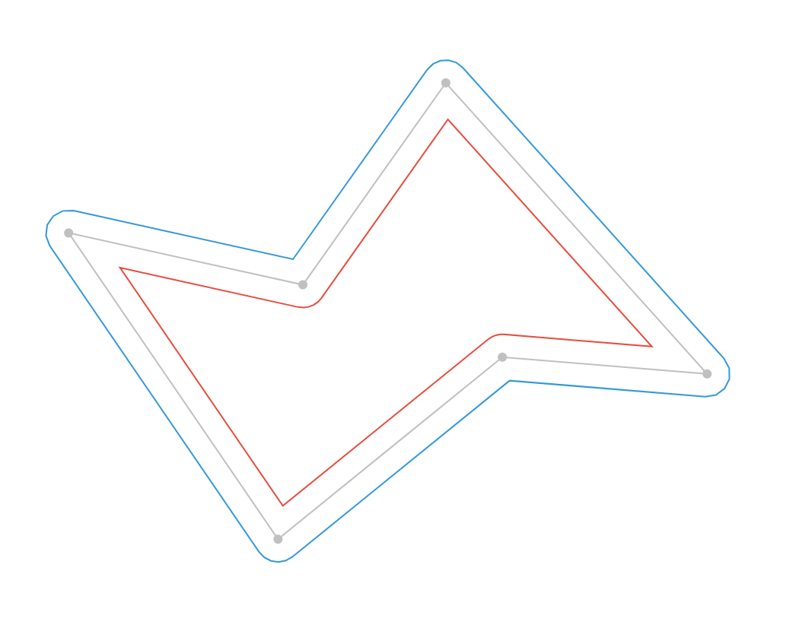

# Offset Polygon

Small, no dependency library for offsetting polygons. Heavily based on this [CodePen](https://codepen.io/HansMuller/pen/lDfzt) by Hans Muller.

[Interactive demo](https://muffinman.io/offset-polygon)

[](https://muffinman.io/offset-polygon)

## Params

```ts
function offsetPolygon(vertices: Vector[], offset: number, arcSegments?: number): Vector[]
```

* `vertices` - array of vector objects `{ x: number, y: number }`
* `offset` - number, how much should the polygon be offset. Positive values will create add margin, and negative padding.
* `arcSegments` - number, default `0`. When set corners of the generated polygon will be rounded, by adding arc segments.

Returns newly generated polygon vertices as an array of vector objects `{ x: number, y: number }`.

## Usage

Get it from npm:

```
npm install @muffinman/offset-polygon
```

```js
import offsetPolygon from "@muffinman/offset-polygon";

const polygon = [
  { "x": 413, "y": 123 },
  { "x": 510, "y": 299 },
  { "x": 395, "y": 487 },
  { "x": 292, "y": 341 },
  { "x": 92,  "y": 327 },
  { "x": 146, "y": 158 },
];

// Padding
const smallerPolygon = offsetPolygon(polygon, -10, 5);

// Margin
const largerPolygon = offsetPolygon(polygon, 10, 5);
```